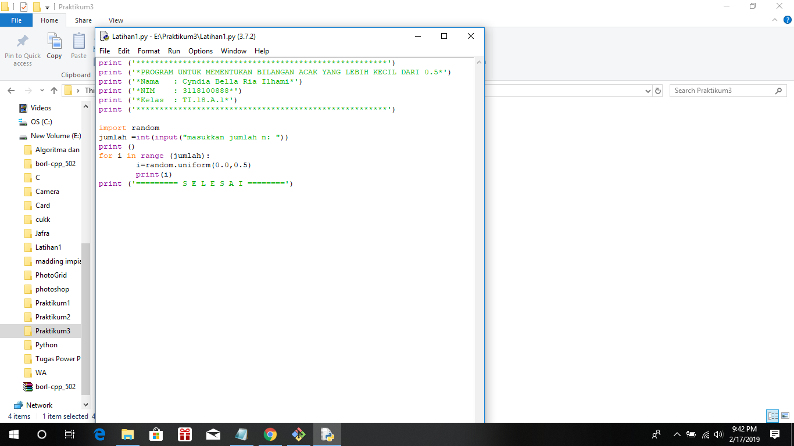
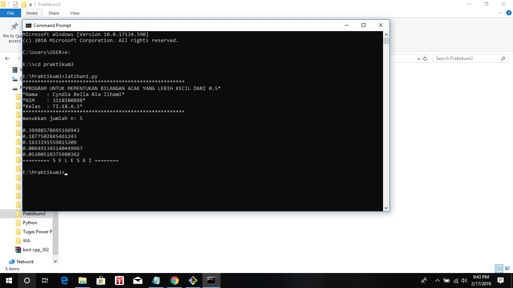
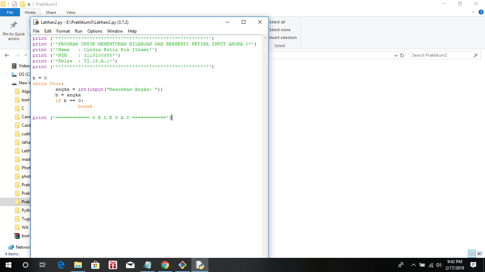
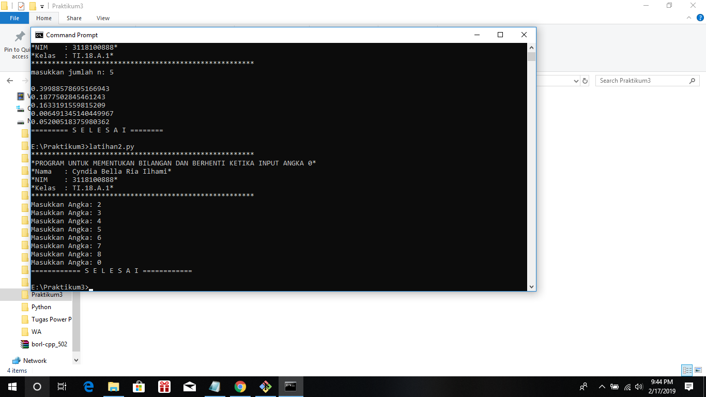
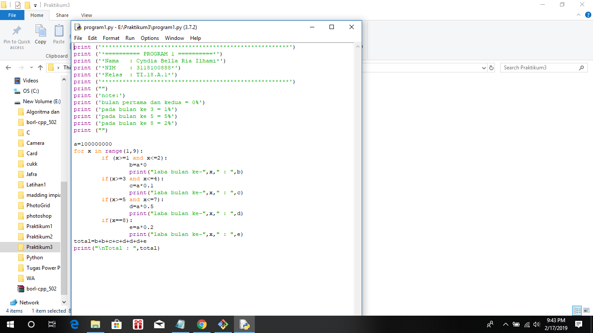
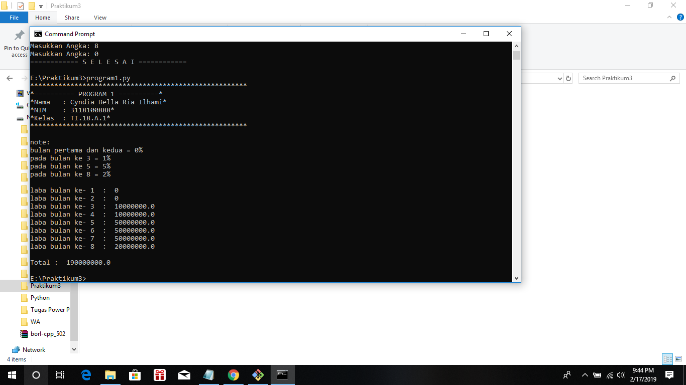

# labpy03
# penjelasan alur algoritma

#Latihan1

1. fungsi
	Fungsi print() berfungsi untuk mencetak atau menampilkan objek ke perangkat keluaran (layar) atau ke file teks.
2. import random
	menggabungkan dua operasi; itu mencari modul yang bernama, kemudian mengikat hasil pencarian itu ke nama di lingkup lokal.
	Operasi pencarian importpernyataan didefinisikan sebagai panggilan ke import()fungsi, dengan argumen yang sesuai.
	Nilai kembali dari import()digunakan untuk melakukan operasi pengikatan nama importpernyataan.
	Lihat importpernyataan untuk detail persis operasi pengikatan nama itu.
3. for
	Jika urutan berisi daftar ekspresi, itu dievaluasi terlebih dahulu. 
	Kemudian, item pertama dalam urutan ditugaskan ke variabel iterating iterating_var . 
	Selanjutnya, blok pernyataan dieksekusi. 
	Setiap item dalam daftar ditugaskan ke iterating_var , dan blok pernyataan dieksekusi sampai seluruh urutan habis.
4. variabel i
	Variabel i berfungsi untuk menampung indeks, dan fungsi range() berfungsi untuk membuat list dengan range dari 0-10. 
	Fungsi str() berfungsi merubah tipe data ineger ke string.
	
Hasilnya :

#Latihan2

1. print
	fungsi print Untuk menampilkan objek ke perangkat pengeluaran.
2. while true
	Pertama menentukan variabel untuk menghitung, sampai perulangan berhenti ketika menginputkan angka 0.

Hasilnya :

#Latihan3

1. for
	Jika urutan berisi daftar ekspresi, itu dievaluasi terlebih dahulu. 
	Kemudian, item pertama dalam urutan ditugaskan ke variabel iterating iterating_var . 
	Selanjutnya, blok pernyataan dieksekusi. 
	Setiap item dalam daftar ditugaskan ke iterating_var , dan blok pernyataan dieksekusi sampai seluruh urutan habis.
2. if
	percabangan if digunakan saat ada satu keputusan.
3. print
	Untuk menampilkan objek ke perangkat pengeluaran.

Hasilnya :

